## AWS EC2 Web Server Deployment + Troubleshooting (Project 4)

This project walks through launching an EC2 instance, installing Apache, hosting a webpage, intentionally breaking the server, diagnosing the outage, and restoring the service.
It reflects real Cloud Support / Cloud Engineer work involving EC2, Linux, Apache, logs, systemctl, and troubleshooting.

### Tech Stack

- AWS EC2 (Amazon Linux 2023)

- Apache HTTP Server

- Linux systemd (systemctl)

- SSH (macOS Terminal)

- AWS Security Groups (SSH + HTTP)

###  What I Did
#### 1. Launched a Web Server

Created an EC2 instance (Amazon Linux 2023, t2.micro).

Connected using SSH and installed Apache.

sudo dnf update -y
sudo dnf install httpd -y
sudo systemctl start httpd
sudo systemctl enable httpd
echo "<h1>Hello from KD's Cloud Server 🚀</h1>" | sudo tee /var/www/html/index.html


Verified the webpage in the browser using the EC2 Public IP.

#### 2. Simulated a Service Outage

To replicate a real production issue, I manually stopped Apache:
```bash

sudo systemctl stop httpd
```

The website became unreachable — exactly as expected.

--- 

#### 3. Diagnosed the Issue

Checked Apache status:
```bash
sudo systemctl status httpd
```
--- 

Reviewed recent error logs:
```bash 

sudo tail -n 20 /var/log/httpd/error_log
```
--- 
#### 4. Restored the Service 

Restarted Apache and ensured it starts automatically on reboot:
```bash 

sudo systemctl start httpd
sudo systemctl enable httpd
```

Confirmed the website was working again.

### Root Cause Analysis (RCA)

Cause: The Apache (httpd) service was intentionally stopped.

Effect: EC2 instance remained healthy, but the web server stopped responding.

Fix: Restarted Apache service.

Prevention:

CloudWatch alarms

Auto-healing configuration

Systemd restart rules

---
### Summary

This project demonstrates real-world cloud support skills including:

Deploying and configuring Linux web servers

Managing and debugging services

Using logs and systemctl for diagnosis

Understanding how EC2 + Apache + security groups work together

It reflects the day-to-day responsibilities of Cloud Support Engineers, DevOps Engineers, and Solutions Architects.

**Screebshots:** 

Below are all 11 screenshots for this project — grouped by stage.

## EC2 Instance & Networking
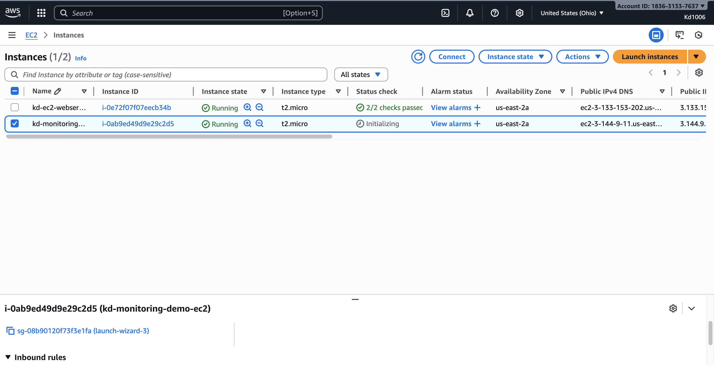

## Install & Configure Web Server (Apache)

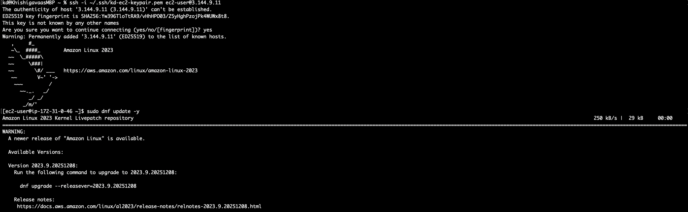

Apache Installed 

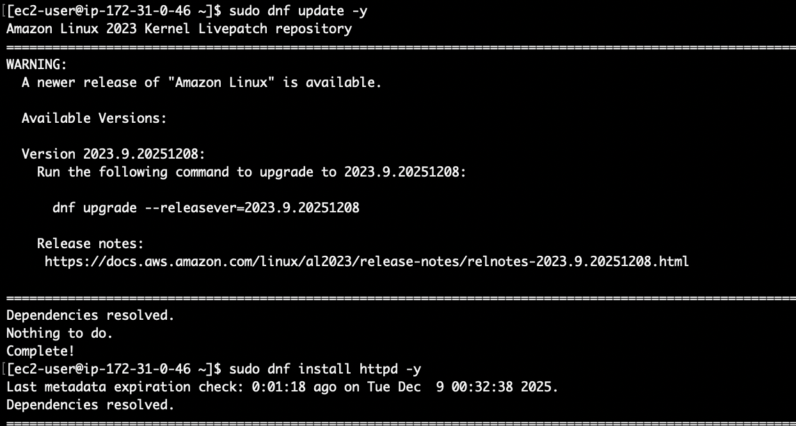 

Securiry Group Updated 

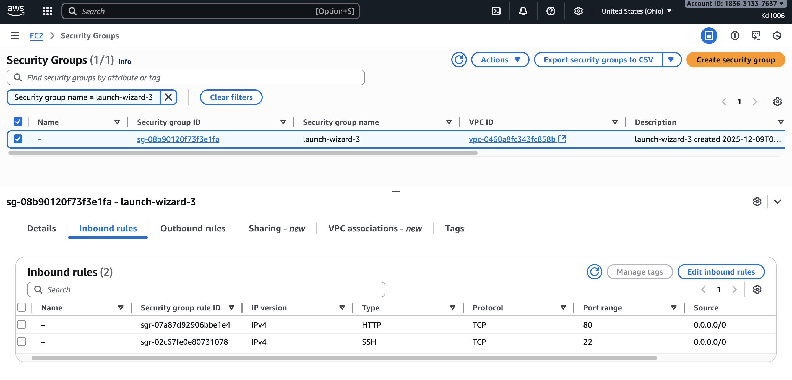

Apache Test Page Visible
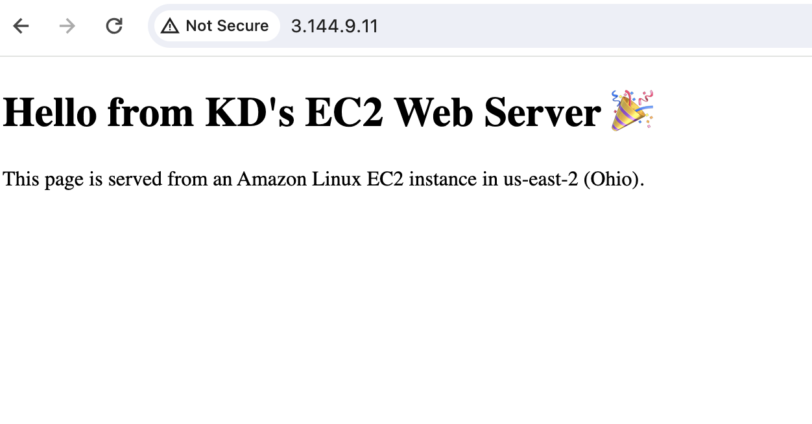

## SNS Notification Setup 
SNS Topic Created 
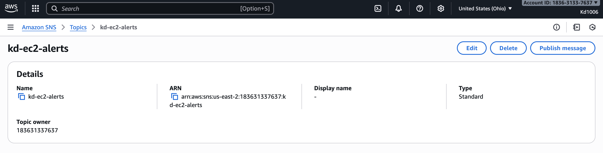

SNS Subscription Confirmed
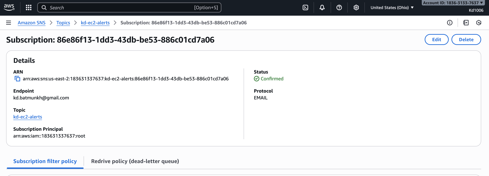

## CLoudWatch Alarm Creation
CloudWatch Alarm created 
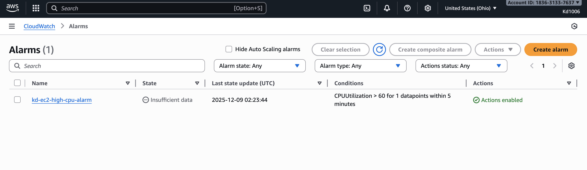

Triggering the Alarm 
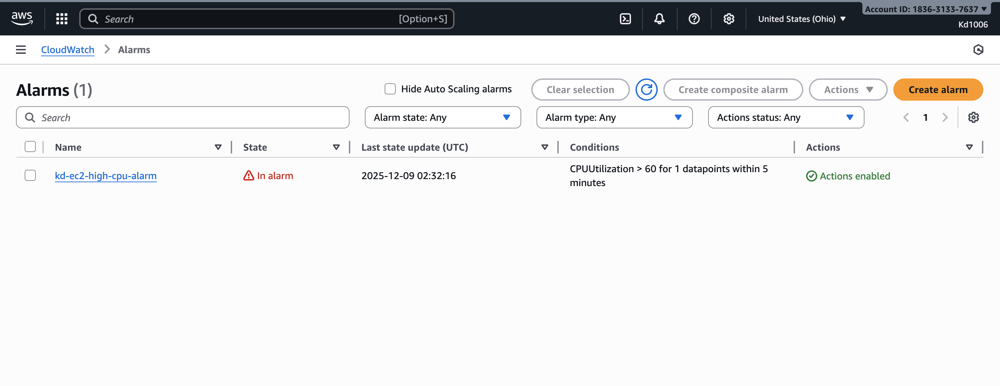

Email Alert Received
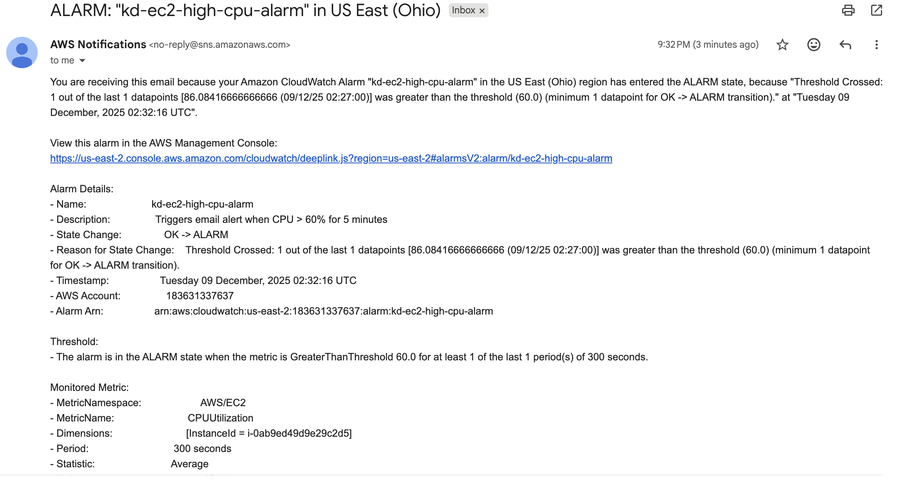

Alarm Recovery 
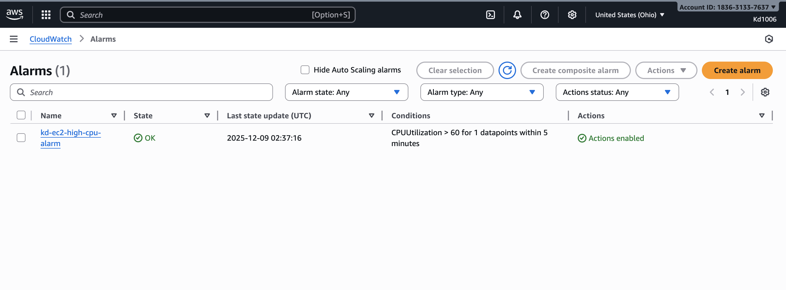


